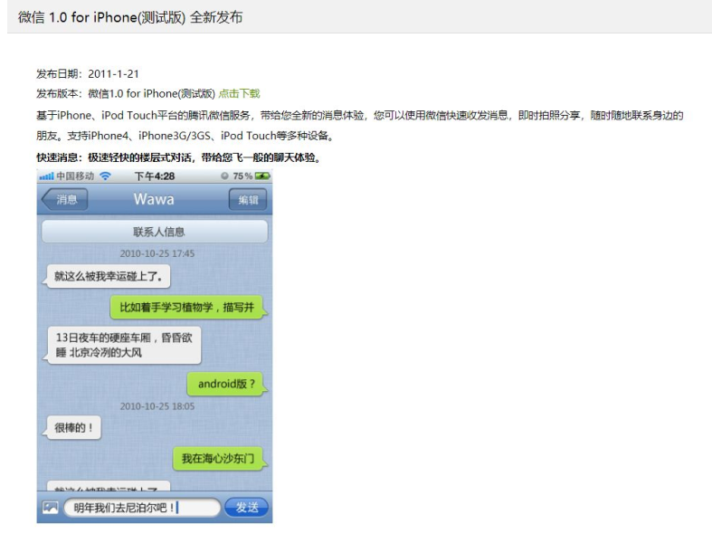
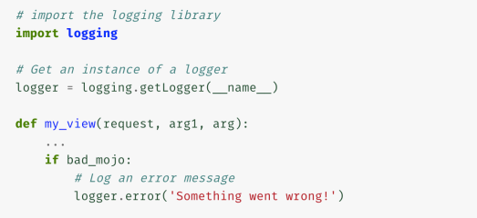

# Django Advanced

## 概述

### Django 实战概述


### Django 课程脉络


## 初识 Django & 开发环境准备

### 初识 Django 

#### 课程需要的基础 

基础条件

- 有一定 Python 基础，能够使用 Python 编写代码
- 有一定的 HTML/CSS/JavaScript 基础（非必须）
- 理解 Web 应用的前后端交互 


#### 学完课程后你能掌握的内容

- 能够使用 Django Admin 搭建管理后台
- 掌握 Django 管理后台的深度定制方法，能够添加定制的功能
- Django 中间件的工作原理，能够自己设计和实现一个中间件
- 能够使用 Django 快速为企业现有系统搭建管理后台
- 精益创业的产品思维，结合 Django 1-2 天快速迭代开发出有用的企业应用 


#### Django 做了什么

- 参考 PHP MyAdmin


- 参考 MongoDB 客户端 


#### Django 适用于哪些场景

-  内容管理系统
  - 博客
  - CMS
  - Wiki
- 企业内部系统
  - 会议室预定
  - 招聘管理
  - ERP & CRM
  - 报表系统
- 运维管理系统
  - CMDB
  - 发布管理
  - 作业管理
  - 脚本管理
  - 变更管理
  - 故障管理 


#### Django 的优点和缺点

- 优点
  - Python 实现，代码干净、整洁
  - 提供管理后台，能够快速开发
  - 复用度高，设计、使用上遵循 DRY（Don’t repeat yourself）  原则
  - 易于扩展复用的中间件
  - 内置的安全框架
  - 丰富的第三方类库
- 缺点
  - 单体应用-不易并行开发，单点扩展
  - 不适合非常小的几行代码的项目
  - 不适合于高并发的 to C 互联网项目 


#### 哪些著名产品使用了 Django 


#### Django 的 MTV 架构 

- Model
- Template
- View


#### Django 的设计思想

- DRY（Don’t repeat yourself）：不重复造轮子
- MVT
- 快速开发
- 灵活易于扩展
- 松耦合
- 显式优于隐式 


### Django 开发环境准备 

#### Anaconda 介绍 

- Python 科学计算工具包：数据科学家的工具箱
- 包含了 Python 二进制发行包
- 包含 Numpy, Pandas, Matplotlib, SciPy, Bokeh, Jupyter，PyTorch, Tensorflow 等科学处理工具
- 包含了一个开源的 Python IDE：Spyder
- 包含了 Conda 包管理软件: conda install xxx 


#### PyCharm 介绍 

- PyCharm IDE，出自 JetBrains 公司，IDEA 系列产品为 JetBrains 产出的产品
- 最好用的免费 Python IDE
- PyCharm 有 Community 版本，有 Enterprise 版本
- PyCharm 社区版不支持 Django 开发， 但可以安装 Django 类库，能够实现 Django 代码的自动提示 


#### 环境准备 

- 推荐使用 Anaconda 版本，下载安装 Anaconda
- https://www.anaconda.com/products/individual
- bash ~/Downloads/Anaconda3-2020.02-MacOSX-x86_64.sh
- 安装Django到本机环境：conda install django


- 安装 PyCharm
- https://www.anaconda.com/pycharm 


#### 使用 Django 创建第一个项目 

- 创建Django项目

  - django-admin startproject recruitment(recruitment为项目名)

- 切换到项目的根目录，启动项目（监听本地所有的IP地址）

  - python manage.py runserver 0.0.0.0:8000
  - 或者
  - python manage.py runserver 127.0.0.1:8000
  - python manage.py runserver

- 浏览器本地访问：127.0.0.1:8000即可看到默认的首页

- Django数据库

  - 默认项目根目录下自动创建“db.sqlite3”文件
  - 可以在settings.py里面指定“db.sqlite3”文件的存放路径或者更改成其他的数据库引擎，如MySQL

- 访问 Django 的 admin 管理后台

  - 访问路径：127.0.0.1:8000/admin （开始无法访问，因为数据库还未初始化，提示没有这个表）
  - (1).数据库迁移，make migrations 创建数据库迁移，产生SQL脚本，使用 migrate 命令把默认的model同步到数据库，Django 会自动为 model 建立数据库表。
  - 数据库迁移：python manage.py makemigrations
  - 自动生成数据库表：python manage.py migrate
  - 此时访问 127.0.0.1:8000/admin 即可看到后台登录页面。

- 创建后台管理员账号

  - python manage.py createsuperuser
  - 根据提示输入对应的用户名，邮箱和密码

- 配置文件settings.py解读

  - 调试模式，应用注册，第三方库配置，中间件，模板引擎，国际化等  

- 后台中英切换

  - ```python
    # LANGUAGE_CODE = 'en-us'
    LANGUAGE_CODE = 'zh-hans'
    ```


## 使用 Django 创建一个应用 – 职位管理系统 

### 产品需求 

1. 管理员能够发布职位
2. 匿名用户能够浏览职位
3. 匿名用户能够投递职位 


### 职位管理系统-建模 

职位名称，类别，工作地点，职位职责，职位要求，发布人，发布日期，修改日期 


### 创建app & 同步数据库 

- 创建项目：django-admin startproject recruitment
- 创建职位app：python manage.py startapp job
- 数据库迁移：python manage.py makemigrations
- 自动生成数据库表：python manage.py migrate


### 职位列表展示 

- 发布职位
- 浏览职位

- 列表页是独立页面，使用自定义的页面
- 添加如下页面
  - 职位列表页
  - 职位详情页
- 匿名用户可以访问 


#### Django 的自定义模板 

- Django 模板包含了输出的 HTML 页面的静态部分的内容
- 模板里面的动态内容在运行时被替换
- 在 views 里面指定每个 URL 使用哪个模板来渲染页面 

- 模版继承与块（Template Inheritance & Block）
  - 模板继承允许定义一个骨架模板，骨架包含站点上的公共元素（如头部导航，尾部链接）
  - 骨架模板里面可以定义 Block 块，每一个 Block 块都可以在继承的页面上重新定义/覆盖
  - 一个页面可以继承自另一个页面
- 定义一个匿名访问页面的基础页面，基础页面中定义页头
- 添加页面 job/templates/base.html 


#### Base 模板 

- 如下 job/templates/base.html 定义了站点的标题
- 使用 block 指令定义了页面内容块，块的名称为 content，这个块可以在继承的页面中重新定义 


#### 添加职位列表页模板 – 继承自 base.html 

- 这里使用 extends 指令来表示，这个模板继承自 base.html 模板
  - Block content 里面重新定义了 content 这个块
  - 变量：运行时会被替换， 变量用 {{variable_name}} 表示，变量是 views 层取到内容后填充到模板中的参数
  - Tag：控制模板的逻辑，包括 if, for, block 都是 tab 


#### 模板内容自动转义 

- 不做内容转义的问题， 对于以下的模板内容

  - 你好 {{ name }}

- 当用户的名字输入如下内容时：

  - <script>alert('hello')</script>

- 结果

  - 模板展现的时候，用户打开的页面会出来一个弹窗（即页面展现时可以动态的代码）
  - 严重的安全漏洞（XSS 跨站脚本攻击）

- 模板内容自动转义：用户输入一段脚本作为名字时，页面展现时标签都被转义 


#### 职位列表的视图 

- 视图里面获取数据，把数据传入到模板中
- 示例中，使用 Django 的 model 来获取数据，数据按照职位类型排序
- 模板渲染指定了使用前面定义的 joblist.html，把 一个含有 job_list 这个 key 的 map 传入到模板 


#### 添加 URL 路径映射 

- 让添加的页面，能够通过 URL 访问到
- /joblist/ 的路径访问到 views 里面定义的 joblist 视图
- 这个视图是一个 Method View，方法表示一个视图 
- 在app 里面的创建一个 urls.py 文件，写入下面内容


#### 应用（app）的所有 URL 定义加入到项目（recruitment）中

- 如下图， 把 job 应用下面的 URL 都加到路由中；
- 收到请求时，先走 jobs 应用下面的 URL 路由找页面，然后再按照 admin/ 路径匹配请求 URL 


#### 职位列表页

- 模板添加定义，View 页面添加完，URL 中也定义路由之后，再访问页面：
- http://127.0.0.1:8000/joblist/ 


### 职位详情页展示

#### 添加职位详情页模板 – 继承自 base.html 

- 前面列表页，每个职位上有一个链接，指向职位详情页
- 同样添加如下 3 块内容：
  - 详情页模板 – 定义内容呈现（Template）
  - 详情页视图 – 获取数据逻辑 （View）
  - 定义 URL 路由 


#### 添加视图 & URL 路径映射 

- 如下在 views.py, urls.py 中分别定义了 View 视图

- 以及 URL 的路由规则 /job/job_id 来访问详情 

  - ```python
    url(r"^job/(?P<job_id>\d+)/$", views.detail, name="detail"),
    
    # ?P<job_id> 可将 访问 URL 中，job 后面的值，作为job_id，传递给 view 层
    ```


#### 职位详情页 


## 产品实战：如何在 1 天之内交付面试评估系统 

### 产品背景，迭代思维与 MVP 产品规划 

#### 线下流程

准备简历 & 面试评估表

- HR：发出面试评估表模板（Word）到一面面试官 （邮箱发出来）
-  一面面试官：登录邮箱下载 Word 模板，每个学生拷贝一份
- 按学生名字命名文件， 录入学生名字，学校，电话，学历等

第一轮面试

- 一面官：每面完一个学生，填写 Word 格式的评估表中
- 一面官：面完一天的学生后，批量把 Word 文档 Email 到 HR
- HR：晚上查收下载评估表，汇总结果到 Excel，通知学生复试
- HR：同时把已经通知复试的学生信息，发送到技术二面复试官

第二轮面试和 HR 面试

- 二面官：查收 Email，下载 Word 格式的一面评估记录
- 二面官：复试后追加复试的评估到 Word 记录中，邮件到 HR
- 类似如上步骤的 HR 复试。 


#### 迭代思维与 MVP 产品规划方法（OOPD）

- MVP：minimum viable product， 最小可用产品
- OOPD：Online & Offline Product Development， 线上线下相结合的产品开发方法
  - 内裤原则：MVP 包含了产品的轮廓，核心的功能，让业务可以运转
  - 优先线下：能够走线下的，优先走线下流程，让核心的功能先跑起来，快速做用户验证和方案验证
  - MVP 的核心：忽略掉一切的细枝末节，做合适的假设和简化，使用最短的时间开发出来
- 迭代思维是最强大的产品思维逻辑，互联网上唯快不破的秘诀
- 优秀的工程师和优秀的产品经理，善于找出产品 MVP 的功能范围 


#### 微信 1.0 的 MVP 迭代

- 只有 3 个功能
  - 聊天发文本消息
  - 发送图片
  - 自定义头像
- 没有更改用户昵称的功能
- 产品的目标
  - 替换掉短信的免费聊天工具 




#### 如何找出产品的 MVP 功能范围？

使用这些问题来帮助确定范围

- 产品的核心目标是什么? 核心用户是谁？核心的场景是什么？
- 产品目标都需要在线上完成或者呈现吗?
- 最小 MVP 产品要做哪些事情，能够达到业务目标?
- 哪些功能不是在用户流程的核心路径上的？
- 做哪些简化，和假设，能够在最短的时间交付产品，并且可以让业务流程跑起来？ 


#### 用户场景和功能清单：找出必须的功能

- 定义最小可用的面试评估系统
- 哪些是可以线下人肉做的事情
- 可以做出哪些假设来简化产品 


### 数据建模 & 企业级数据库设计原则

#### 数据建模

- 姓名,城市,本科学校,研究生学校,手机号码,邮箱,学历,专业, 应聘职位,测评成绩,笔试成绩,生源地
- 初试评估结果
  - 初试-学习能力得分
  - 初试-专业能力得分
  - 初试-优势,初试-顾虑和不足
  - 初试结果
  - 初试-推荐部门
- 1面面试官, 2面面试官
- 复试评估结果
  - 复试1得分,复试1-学习能力得分
  - 复试1-专业能力得分
  - 复试1-追求卓越得分
  - 复试1-沟通能力得分
  - 复试1-抗压能力得分
  - …… 


#### 企业级数据库设计十个原则

3 个基础原则，4 个扩展性原则，3 个完备性原则

##### 3 个基础原则

- 结构清晰：表名、字段命名没有歧义，能一眼看懂
- 唯一职责：一表一用，领域定义清晰，不存储无关信息，相关数据在一张表中
- 主键原则：设计不带物理意义的主键；有唯一约束，确保幂等 


##### 4 个扩展性原则（影响系统的性能和容量）

- 长短分离：可以扩展，长文本独立存储；有合适的容量设计
- 冷热分离：当前数据与历史数据分离
- 索引完备：有合适索引方便查询
- 不使用关联查询：不使用一切的 SQL Join 操作，不做 2 个表或者更多表的关联查询
  - 示例：查询商家每一个订单的金额
  - 一旦出现分库分表，数据表不在一个数据库，就没法join了
  - select s.shop_name, o.id as order_id, o.total_amount from shop s, order o where s.id = o.shop_id 


##### 3 个完备性原则

- 完整性：保证数据的准确性和完整性，重要的内容都有记录
- 可追溯：可追溯创建时间，修改时间，可以逻辑删除（数据最好不要物理删除，只需要进行标志逻辑删除即可）
- 一致性原则：数据之间保持一致，尽可能避免同样的数据存储在不同表中 


### 创建应用和模型，分组展示页面内容

- 创建应用:
  - python ./manage.py startapp interview
- 注册应用
  - 在 settings.py 中添加 interview 应用
- 添加模型
  - 在 interview/models.py 里面定义 Candidate 类 


#### 参考资料

- 使用 Model 模型
  - https://developer.mozilla.org/zh-CN/docs/Learn/Server-side/Django/Models
  - https://docs.djangoproject.com/en/3.1/topics/db/models/
- 使用 Admin 管理类
  - https://developer.mozilla.org/zh-CN/docs/learn/Server-side/Django/%E7%AE%A1%E7%90%86%E7%AB%99%E7%82%B9
  - https://docs.djangoproject.com/en/3.1/ref/contrib/admin/


#### 知识点

- 应用中展示的数据表名字，使用中文显示

```python
    class Meta:
        db_table = u'candidate'
        verbose_name = u'应聘者'
        verbose_name_plural = u'应聘者'
     # Python 2 优先使用这个方法，把对象转换成字符串； 如果没有__unicode__()方法，使用 __str__()方法
    def __unicode__(self):
        return self.username

    # Python 3 直接定义 __str__() 方法即可，系统使用这个方法来把对象转换成字符串
    def __str__(self):
        return self.username
```


- 自定义 数据表 的展示行为

```python
class ModelAdmin(BaseModelAdmin):
    """Encapsulate all admin options and functionality for a given model."""

    list_display = ('__str__',)  # 重写 list_display 变量的值，自定义展示列表的字段
    list_filter = ()  # 重写 list_filter 变量的值，在列表左侧添加筛选的栏目
    ordering = None  # 重写 ordering 变量的值，自定义列表展示的排序方式，带有优先级排序
    exclude = None  # 重写 exclude 变量的值，排除数据表展示的 数据字段
    search_fields = ()  # 重写 search_fields 变量的值，自定义搜索的字段项
    fieldsets = None  # 重写 fieldsets 变量的值，自定义数据表展示的 排序块
    # fieldsets 格式，
    # fieldsets = (
    #     (None, {"fields": ("userid",)}),
    #     ("第一轮面试", {"fields": ("first_score",)}),
    # ),
```


#### 实现候选人数据导入 

- 怎么样实现一个数据导入的功能最简洁
  - 开发一个自定义的 Web 页面，让用户能够上传 excel/csv 文件
  - 开发一个命令行工具，读取 excel/csv，再访问数据库写入 DB
  - 从数据库的客户端，比如 MySQL 的客户端里面导入数据
- Django 框架已经考虑到（需要使用到命令行的场景）
  - 使用自定义的 django management 命令来导入数据
  - 应用下面创建 management/commands 目录，
  - commands 目录下添加脚本，创建类，继承自 BaseCommand，实现命令行逻辑 
- 命令行导入
  - python manage.py import_candidates --path /path/to/your/file.csv 
- 参考：django_python3_ldap 包


#### 候选人列表筛选和查询

- 能够按照名字、手机号码、学校来查询候选人信息
- 能够按照初试结果，复试结果，HR复试结果，面试官来筛选
- 能按照复试结果来排序 

```python
    # 查询字段
    search_fields = (
        "username", "phone", "email",
        "bachelor_school",
    )
    # 筛选条件
    list_filter = (
        "city",
        "first_result", "second_result", "hr_result",
        "first_interviewer_user", "second_interviewer_user", "hr_interviewer_user",
    )
    # 排序
    ordering = (
        "hr_result", "second_result", "first_result",
    )
```


### 企业域账号集成 

- 什么是目录服务 Directory Service ?
- 可以直接使用域账号登陆
- 不用手工添加账号，维护独立密码
- 可以集成 OpenLDAP/ActiveDirecotry
- 以 Open LDAP 为例
  - DN: 目录服务中的一个唯一的对象
  - CN=David,OU=Shanghai,DC=ihopeit,DC=com 


#### Open LDAP 服务搭建 

- Docker 启动 OpenLDAP 服务 & phpldapadmin-service 

- 安装 openldap 和 phpldapadmin

  - 

  ```sh
  docker run -p 389:389 -p 636:636 --name my-openldap-container --env LDAP_ORGANISATION="ihopeit" --env LDAP_DOMAIN="ihopeit.com" --env LDAP_ADMIN_PASSWORD="admin_passwd_4_ldap" --detach osixia/openldap:1.4.0
  
  docker run -d --privileged -p 8080:80 --name phpldapadmin-service --env PHPLDAPADMIN_HTTPS=false --env PHPLDAPADMIN_LDAP_HOSTS=192.168.1.101 --detach osixia/phpldapadmin
  
  # 本地安装 phpldapadmin-service 失败
  # docker run -p 80:80 -p 443:443 --name phpldapadmin-service2 --hostname phpldapadmin-service --link my-openldap-container:ldap-host --env PHPLDAPADMIN_LDAP_HOSTS=ldap-host --detach osixia/phpldapadmin:0.9.0
  ```

  - 参考 安装 openldap 链接：https://blog.csdn.net/qq_41916805/article/details/107206646
  - 注意： 以上命令开放了 389 端口， 以及 8080 端口到外网
  - 阿里云服务器，需要在安全组里面开放 389, 443 端口； 不建议 80 端口开放出来 

- 登录 phpldapadmin-service ，本机 ip 为 192.168.1.119，则：http://192.168.1.119:8080/

- 登录账号和密码

  - loginDN: cn=admin,dc=ihopeit,dc=com 
  - password:admin_passwd_4_ldap


#### 面试官的导入、授权

- 从 Open LDAP/AD 中导入面试官信息
  - 同步账号到Django
  - 设置面试官群组，授予群组权限：查看应聘者、修改应聘者（评估）
  - 设置用户属性 is_staff 为true : 允许登陆 Django Admin
  - 添加用户到群组： 使得面试官登陆后，可以填写反馈 
- `pip install django_python3_ldap`
- `python manage.py ldap_sync_users`


### 增加自定义的数据操作菜单 （数据导出为 CSV）

- 场景：需要对数据进行操作，比如导出，状态变更 （如 标记候选人为 “待面试”）
- 定义按钮的实现逻辑（处理函数） & 在 ModelAdmin 中注册函数到 actions 

```python
# 导出应聘者信息到 csv 文件
def export_model_as_csv(modeadmin, request, queryset):
    pass

# 将函数操作的展示变为中文
export_model_as_csv.short_description = u"导出为CSV文件"

# 导出信息到csv文件行为
actions = [export_model_as_csv, ]
```


#### 自定义按钮： 数据导出为 CSV 


### 日志记录 

- 四个组件
  - Loggers：日志记录的处理类/对象，一个 Logger 可以有多个 Handlers
  - Handlers：对于每一条日志消息如何处理，记录到文件，控制台，还是网络
  - Filters： 定义过滤器，用于 Logger/Handler 之上
  -  Formmaters: 定义日志文本记录的格式
- 四个日志级别
  - DEBUG: 调试
  -  INFO: 常用的系统信息
  -  WARNING: 小的告警，不影响主要功能
  - ERROR: 系统出现不可忽视的错误
  -  CRITICAL: 非常严重的错误 


#### 使用日志记录

- 记录 debug, info, warning, error, critical 不同级别日志 




#### 配置日志记录

- Django 里面使用 dictConfig 格式来配置日志
-  Dictionary 对象，至少包含如下内容:
  - version, 目前唯一有效的值是 1
  -  Handler, logger 是可选内容，通常需要自己定义
  -  Filter, formatter 是可选内容，可以不用定义 
- 简单版本

```python
# LOG
# Simple version
LOGGING = {
    "version": 1,
    "disable_existing_loggers": False,
    "handlers": {
        "console": {
            "class": "logging.StreamHandler",
        },
    },
    "loggers": {
        "django_python3_ldap": {
            "handlers": {"console"},
            "level": "DEBUG",
        },
    },
}
```

- 定义日志输出格式， 分别定义 全局日志记错， 错误日志处理， 自定义的 日志处理器 


### 生产环境与开发环境配置分离

- 问题
  - 生产环境的配置与开发环境配置隔离开， 开发环境允许 Debugging
  -  敏感信息不提交到代码库中，比如数据库连接，secret key, LDAP连接信息等
  - 生产、开发环境使用的配置可能不一样，比如 分别使用 MySQL/Sqlite 数据库 

- 推荐方案
  - 把 settings.py 抽出来，创建3个配置文件
    - base.py 基础配置
    -  local.py 本地开发环境配置，允许 Debug
    - production.py 生产环境配置， 不进到 代码库版本控制
  - 命令行启动时指定环境配置
    - python ./manage.py runserver 127.0.0.1:8000 --settings=settings.local
    - 使得 manage.py 中的如下代码失效
      - os.environ.setdefault('DJANGO_SETTINGS_MODULE', 'settings.base') 


### 产品细节完善

- 修改站点标题

- ```python
  admin.site.site_header = _("rmliu 招聘管理系统")
  ```

- 自动保存面试官信息

- ```python
      def save_model(self, request, obj, form, change):
          obj.last_editor = request.user.username
          if not obj.creator:
              obj.creator = request.user.username
          obj.modified_date = datetime.now()
          obj.save()
  ```

- 设置只读字段: readonly_fields = ('first_interviewer','second_interviewer',)

- ```python
      # 设置面试官为只读字段，只有 HR 才可以进行设置
      # readonly_fields = ("first_interviewer_user", "second_interviewer_user",)
      def get_readonly_fields(self, request, obj=None):
          group_names = self.get_group_names(request.user)
  
          if "interviewer" in group_names:
              logger.info("interviewer is in user's  group for %s", request.user.username)
              return ("first_interviewer_user", "second_interviewer_user",)
          return ()
  ```

- 设置字段提示 help_text ：初试分，学习能力得分，专业能力得分范围 0-5 分

- ```python
      first_score = models.DecimalField(decimal_places=1, null=True, max_digits=2, blank=True, verbose_name=u'初试分', help_text=u'1-5分，极优秀: >=4.5，优秀: 4-4.4，良好: 3.5-3.9，一般: 3-3.4，较差: <3分')
  
  ```

- 设置列表编辑面试官，不需要进入详情页，只有 HR 才可以进行设置

- ```python
      # 设置列表编辑面试官，不需要进入详情页，只有 HR 才可以进行设置
      # get_list_editable 不在 Django中，使用get_changelist_instance进行父类方法的覆盖
      default_list_editable = ("first_interviewer_user", "second_interviewer_user",)
  
      def get_list_editable(self, request):
          group_names = self.get_group_names(request.user)
  
          if request.user.is_superuser or "hr" in group_names:
              return self.default_list_editable
          return ()
  
      def get_changelist_instance(self, request):
          self.list_editable = self.get_list_editable(request)
          return super(CandidateAdmin, self).get_changelist_instance(request)
  
  ```

- 生成项目依赖: pip freeze > requirements.txt 

  - 任何应用程序通常需要设置安装所需并依赖一组类库来满足工作要求。通过requirements.txt可以一次性安装程序所需要和依赖的包。
  - 1、freeze方式: `pip freeze > requirements.txt`
  - 将当前Python环境中**所有的类库包**，其它包括那些你没有在当前项目中使用的类库，保存至requirements.txt 。至此，requirements.txt文件会出现在相应的工程中 
  - 如果要安装requirements.txt中的类库内容，那么你可以执行：pip install -r requirements.txt
  - 2、pipreqs方式：pipreqs ./
  - 将当前项目**使用的类库导出**生成为 requirements.txt；
  - 安装pipreqs: pip install pipreqs


### 参考

- Django document
- https://docs.djangoproject.com/en/3.1/ref/contrib/admin/actions/
- https://docs.djangoproject.com/en/3.1/ref/contrib/admin/#django.contrib.admin.ModelAdmin.list_filter
- https://github.com/osixia/docker-openldap


## 用1天时间完善产品 - 简历投递和面试流程闭环 

### 更美观的管理后台：替换Django admin的主题风格 

- 安装 django-grappelli 风格

  - pip install django-grappelli

- settings.py 中配置

  - ```python
    INSTALLED_APPS = [
        'grappelli',
    ]
    ```

- urls.py 中添加 URL 映射

  - ```python
    urlpatterns = [
        path('grappelli/', include('grappelli.urls')),
        path('admin/', admin.site.urls),
    ]
    ```


### 定制面试官权限 

- 数据权限
  - 专业面试官仅能评估自己负责的环节
- 数据集权限 (QuerySet)
  - 专业面试官只能看到分到自己的候选人
- 功能权限（菜单/按钮）
  - 数据导出权限仅 HR 和超级管理员可用 


#### 定制权限

- **数据权限**： 
  - 一面面试官仅填写一面反馈， 二面面试官可以填写二面反馈
  - def get_fieldsets(self, request, obj=None):
- **数据集权限**：
  - 对于面试官，获取自己是一面面试官或者二面面试官的候选人集合
  - def get_queryset(self, request):
- 功能/菜单权限
  - 自定义权限： 在 Model 类的 Meta 中定义自定义的 permissions
  - 同步数据库：./manage.py makemigrations && ./manage.py migrate
  - 在 action 上限制权限： export_model_as_csv.allowed_permissions = ('export’,)
  - 在 Admin 上检查权限： def has_export_permission(self, request) 


### 发送通知：钉钉群消息集成

- 为什么不使用 Email/SMS 通知
  - 由于邮件、短信没有限制，可以给任何人发；网络上对于 API 调用有了各种限制
  - 阿里云封禁 25 端口
- 为什么使用钉钉群消息
  - 可以使用 Web Hook 直接发送，简单易用
  - 低成本
- 其他推荐消息方式
  - Slack 消息
  - 企业微信消息 


#### 测试钉钉群消息

- 安装钉钉聊天机器人：
  -  pip install DingtalkChatbot
- 自定义 interview.dingtalk.send() 方法，发送钉钉消息
- 测试群消息 
  - python ./manage.py shell --settings=settings.local
  - from interview import dingtalk
  - dingtalk.send("秋季招聘面试启动通知, 自 2020/09/01 开始秋季招聘") 


#### 定制管理后台的操作按钮：通知面试官准备面试

- 定义 通知面试官的方法

  - def notify_interviewer(modeladmin, request, queryset)

- 注册到 modeladmin中

  - actions = (export_model_as_csv, notify_interviewer, ) 

- 添加发送成功，页面提示消息

  - ```python
    messages.add_message(request, messages.INFO, "已经成功发送面试通知!")
    ```


### 集成 registration，允许候选人注册登陆

- 允许注册：安装 registration

  - pip install django-registration-redux
  - registration 有三种对待匿名用户的方式：1）注册，邮件激活账号，2）注册，管理员授权后，激活账号，3）注册，直接就可以使用

- 添加到 apps 中

  - ```python
    INSTALLED_APPS = [
        'grappelli',
        'registration',
    ]
    ```

- 同步数据库

- 添加 url

  - ```python
    urlpatterns = [
        url(r"^", include("jobs.urls")),
        path('grappelli/', include('grappelli.urls')),
        path('admin/', admin.site.urls),
    
        url(r"^accounts/", include("registration.backends.simple.urls"))
    ]
    ```

- 链接

  - 注册：http://127.0.0.1:8000/accounts/register/
  - 登录：http://127.0.0.1:8000/accounts/login/
  - 注销：http://127.0.0.1:8000/accounts/logout/

- 添加登陆，退出链接到 base.html 页面中 

  - 整合职位列表与登录跳转页面
  - base.html
  - job.html
  - joblist.html


### 创建简历 Model （为投递简历做准备）

- 创建 Model (Resume)
- 注册 Model 到 Admin 中，设置展示字段
- 同步数据库
- 授予管理权限到 HR 


### 职位详情页：候选人简历投递

- 目标

  - 注册的用户可以提交简历
  - 简历跟当前用户关联
  - 能够追溯到谁投递的简历

- 步骤

  - 定义简历创建 View (继承自通用的CreateView)

  - ```python
    class ResumeCreateView(LoginRequiredMixin, CreateView):
        pass
    ```

  - 定义简历创建页面的表单模板

  - 关联“申请职位”按钮的点击事件到简历提交页

  - ```html
    <input type="button" class="btn btn-primary" style="width:120px;" value="申请" onclick="location.href='/resume/add/?apply_position={{ job.job_name }}&city={{ job.city_name }}'"/>
    ```

  - 进一步完善， 可以带参数跳转 && 关联登陆用户到简历 


### 使用 Bootstrap 来定制页面样式

- 安装依赖包： 

  - pip install django-bootstrap4

- 添加到 apps 中: bootstrap4

- 模板里面使用 bootstrap 标签 

- ```django
  {# Load the tag library#}
  
  
  {# Load CSS and JavaScript #}
  
  
  
  {# Display django.contrib.messages as Bootstrap alerts#}
  
  ```

- 注意
  - 使用 Bootstrap 会导致页面加载过程很慢！
  - 因为js，css文件默认用的国外的文件，会很慢很慢。要collectstatistics，用本地nginx提供静态资源服务，或者走cdn
- 自定义本地静态文件
  
  - 创建static，进行一类文件操作


### 简历初评，安排一面面试官

- 目标：

  - 打通简历投递与面试流程，让简历实体 (Resume) 流转到候选人实体 (Candidate)

- 添加一个数据操作菜单“进入面试流程”

- 定义 enter_interview_process方法

  - def enter_interview_process(modeladmin, request, queryset)

  - 方法逻辑： 拷贝 Resume 对象中的属性 到 Candidate, 保存 Candidate, 消息提示成功保存

  - ```python
    def enter_interview_process(modeladmin, request, queryset):
        pass
    	messages.add_message(request, messages.INFO, "候选人: %s 已经成功进入面试流程" % (candidate_names))
    ```

- 注册到 modeladmin中

  - ```python
    actions = (enter_interview_process,)
    ```


### 定制列表字段，查看简历详情

- 添加 ResumeDetailView 的详情页视图，使用 Django的通用视图，继承自 DetailView

  - ```python
    class ResumeDetailView(DetailView):
        pass
    ```

- 添加 Detail 页模板：

  -  resume_detail.html

- 候选人列表页， 对于每一行来自简历投递的数据，添加一个“查看简历”的链接:

  - ```python
        # 列表添加跳转简历详情页列
        def get_resume(self, obj):
            if not obj.phone:
                return ""
            resumes = Resume.objects.filter(phone=obj.phone)
            if resumes and len(resumes) > 0:
                return mark_safe(u'<a href="/resume/%s" target="_blank"> %s </a>' % (resumes[0].id, "查看简历"))
            return ""
    
        get_resume.short_description = "查看简历"
        get_resume.allow_tags = True
    ```

- 列表页，使用 函数名称 作为 list_display 中的字段

  - ```python
        # 展示的字段
        list_display = (
            "username", "city", "bachelor_school",
            "get_resume",
            ...
        )
    ```

- 定义一个函数， 获取 简历详情页链接 


### 参考资料

- 通用视图的使用:
  - https://developer.mozilla.org/zh-CN/docs/learn/Server-side/Django/Generic_views
  - https://docs.djangoproject.com/en/3.1/topics/class-based-views/generic-display/
  - https://docs.djangoproject.com/en/3.1/ref/class-based-views/generic-editing/
- 表单的使用
  - https://docs.djangoproject.com/en/3.1/topics/forms/modelforms/
- Registration组件
  - https://django-registration-redux.readthedocs.io/en/latest/simple-backend.html


## 日常开发中常见的复杂场景：Django进阶开发实战 

### 遗留系统集成：为已有数据库生成管理后台 

- 问题
  - 已经有内部系统在运行了，缺少管理功能，希望能有一个权利后台。
  - 比如 人事系统，CRM，ERP 的产品，缺少部分数据的维护功能
- 诉求
  - 3分钟生成一个管理后台；
  - 可以灵活定制页面；
  - 不影响正在运行的业务系统。 

- 创建项目: 
  - $ django-admin startproject empmanager
- 编辑 settings.py 中的数据库配置,
  - vim ~/settings.py
  - DATABASES = {
    'default’: {
    'ENGINE': 'django.db.backends.mysql', 'NAME': 'mydatabase',
    'USER': 'mydatabaseuser', 'PASSWORD': 'mypassword', 'HOST': '127.0.0.1', 'PORT':
    '5432',
    }
    }
- 生成 model 类: 
  - ./manage.py inspectdb > models.py 
  - 基于数据库反推数据库models
  - 需要将不需要的数据表移除，还需要进行自定义的models修改


### Django 的中间件（Middleware） 

- 什么是中间件 Middleware ?
  - 注入在 Django 请求/响应 处理流程中的钩子框架，能对 request/response 作处理
- 广泛的使用场景
  - 登录认证，安全拦截
  - 日志记录，性能上报
  - 缓存处理，监控告警….
- 自定义中间件的 2 种方法
  - 使用函数实现
  - 使用类实现 


#### Django的中间件（Middleware）: 函数实现 


#### Django的中间件（Middleware）: 类实现

- Django 提供的 get_response 方法：
- 可能是一个真实的视图，也可能是请求处理链中的下一个中间件 


#### 创建一个请求日志，性能日志记录中间件

- 定义实现中间件: def performance_logger_middleware(get_response)
-  记录请求 URL， 参数， 响应时间
- 注册 middleware 到 settings 中
- 配置 日志文件路径 

```python
def performance_logger_middleware(get_response):
    def middleware(request):
        start_time = time.time()

        response = get_response(request)

        duration = time.time() - start_time
        response["X-page-Duration-ms"] = int(duration * 1000)

        logger.info("%s %s %s", duration, request.path, request.GET.dict())
        return response

    return middleware
```


#### 性能记录

- 输出到 Response Header 里面的 X-Page-Ducration-ms 


### Django 中支持多语言 


#### 使用多语言步骤

- 代码中使用 gettext, gettext_lazy 获取多语言资源对应的文本内容
- 生成多语言资源文件
- 翻译多语言内容
- 生成二进制多语言资源文件 


#### 使用多语言操作

- Model，以及 Django 的 python 代码里面使用多语言
- mkdir locale
- 安装kite插件，进行代码自动补全
- 生成文本格式的多语言资源文件 .po 文件
  - django-admin makemessages -l zh_HANS -l en
- 翻译 .po 文件中的内容到不同语言
- 编译生成可以高效使用的二进制文件 (.mo) 文件
  -  django-admin compilemessages 


#### gettext错误

错误：CommandError: Can't find msguniq. Make sure you have GNU gettext tools 0.15 or newer installed.

link: https://stackoverflow.com/questions/27220052/django-i18n-make-sure-you-have-gnu-gettext-tools/39406251

link：https://stackoverflow.com/questions/38806553/how-to-install-gnu-gettext-0-15-on-windows-so-i-can-produce-po-mo-files-in

Just below solution solved my problem. I am using Windows 10 64bit

1- Go to this link : https://mlocati.github.io/articles/gettext-iconv-windows.html

2- Download 32 or 64 bit **shared** and **static** windows installation files

3-Install both of files

4-Restart your computer


### Sentry 集成 

- 两种方法安装 Sentry ：

  - 使用 Docker 官方服务（量大需要付费，使用方便）；
  - 自己搭建 服务（从源码安装，或者使用docker 搭建服务）；

- 使用 Docker 来安装 sentry, 使用 release 版本 
  - download：https://github.com/getsentry/onpremise/releases/tag/20.8.0

  - unzip

  -  cd  onpremise-20.8.0

  -  docker --help

  -  ./install.sh

- ```sh
  $ ./install.sh
  Checking minimum requirements...
  
  Creating volumes for persistent storage...
  Created sentry-data.
  ...
  
  Fetching and updating Docker images...
  
  ```

  - docker-compose up -d
- docker-compose stop
  
  - docker ps |  less
- 创建账号和密码
  
  -  http://127.0.0.1:9000/organizations/sentry/issues/
-  Settings >>> Create teams
  
-  Settings >>> Create projects
  
- Django 配置集成 sentry ， 自动上报未捕获异常， 错误日志 

  - 一切都准备了，但是还是无法在 sentry 中看到记录


#### Sentry 集成 -日志上报


#### Sentry 集成 -性能监控

- 95线，50线


#### 异常上报 & 异常发送钉钉群 

- 使用中间件捕获异常上报 
- 重写异常捕获类


### Django 的安全：如何防止 XSS 跨站脚本攻击 


### Django 的安全：CSRF 跨站请求伪造 

- 本地启动一个 http 服务
- 创建一个文件夹，创建一个http文件
- 进入文件夹，执行命令：python -m http.server 7000


### Django的安全：SQL注入攻击 


### Django Rest Framework 开放 API 

- https://www.django-rest-framework.org/#installation
- 进行配置
- 浏览器访问：http://127.0.0.1:8000/api/
- curl http://127.0.0.1:8000/api/jobs/
- 指定用户名密码的curl： curl -u admin:admin http://127.0.0.1:8000/api/jobs/


### Django 中使用缓存 

- Django-redis官网文档：https://django-redis-chs.readthedocs.io/zh_CN/latest/
- redis 安装教程：https://www.runoob.com/redis/redis-install.html
- redis-server.exe redis.windows.conf
- redis-cli.exe -h 127.0.0.1 -p 6379


### Django 与 Celery 集成：异步任务


